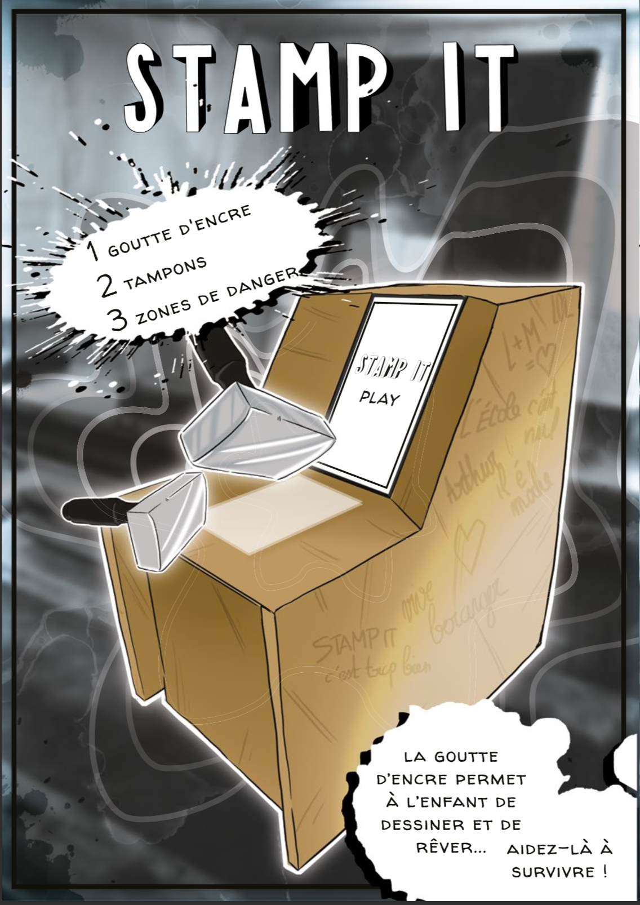
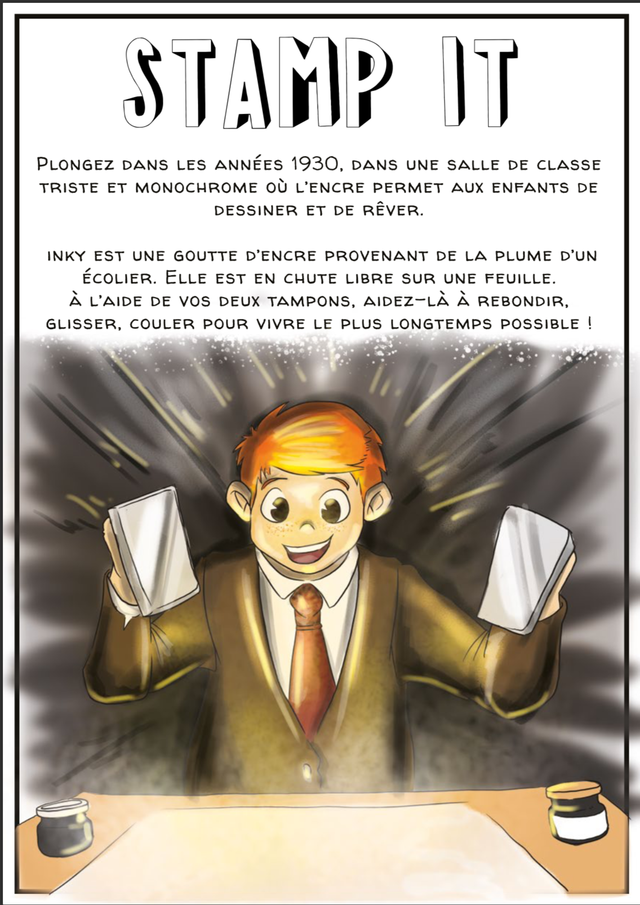
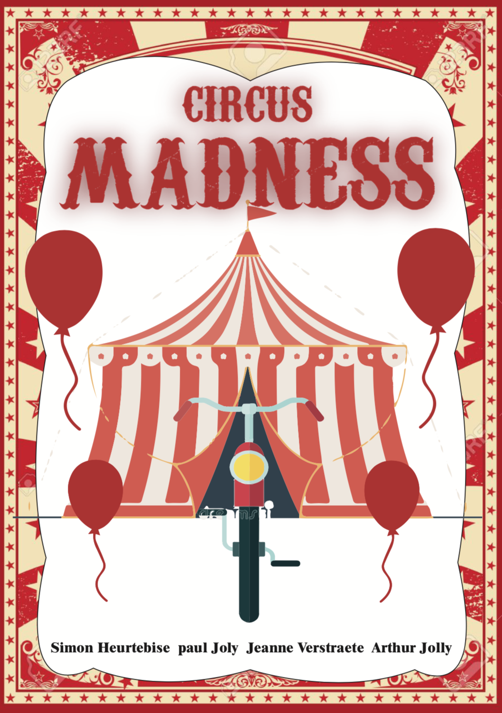
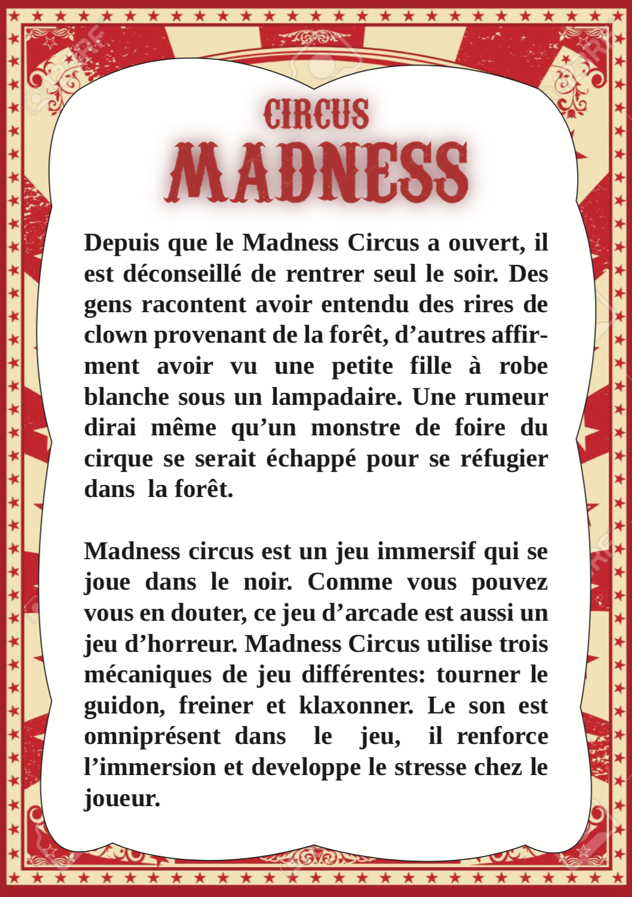
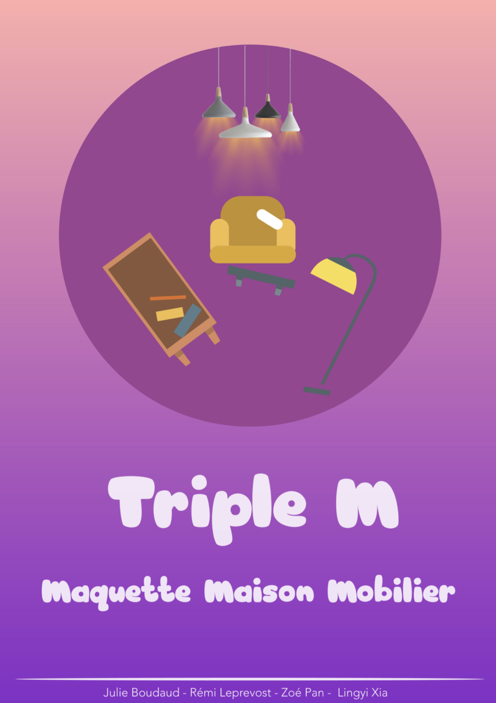
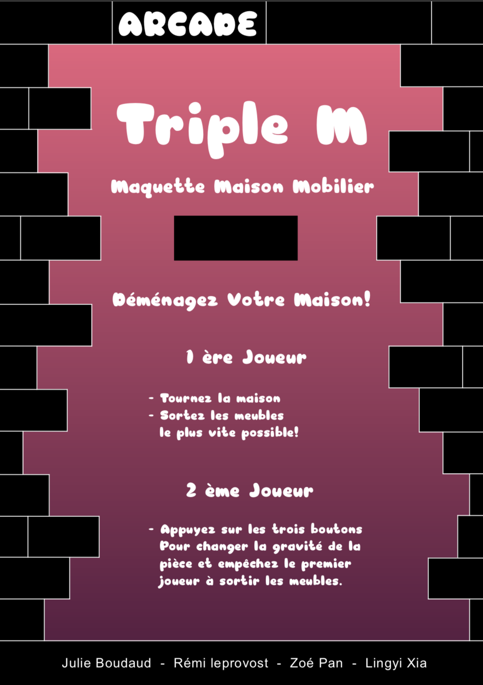

# workshop_alt_ctrl_1920

[Code and documentation](https://github.com/AtelierNum/workshop_alt_ctrl_1920) for the alternative controller workshop by interaction and game design students @lecolededesign.

Students were asked to imagine an alternative way to play and design an unusual controller and the game associated with it in four days..

Files can be found on [github](https://github.com/AtelierNum/workshop_alt_ctrl_1920)

[Code et documentation](https://github.com/AtelierNum/workshop_alt_ctrl_1920) pour le workshop "controleur alternatif" réalisé par les étudiants en design d'interaction et de game design @lecolededesign. Ce projet est réalisé à l'aide d'arduino.

Les étudiants avait pour mission, en quatre jour d'imaginer un controleur de jeu vidéo alternatif ainsi que le jeu vidéo associé.

Les fichiers peuvent-être téléchargés sur [github](https://github.com/AtelierNum/workshop_alt_ctrl_1920)

---
## Stamp-it

Ce projet a été réalisé par : 
[Emilie Schaffer](www.emilie-schaefer.com), [Riwan Madjitate](https://www.fichier-pdf.fr/2020/02/17/riwan-majidate-portfolio-2020/), [Théo Geiller](http://theogeiller.com/), [Raphaël Perraud](http://raphaelperraud.com/#/)

La documentation du projet est disponible [ici](Stamp_It/README.md)

---
## Don't drop it

Ce projet a été réalisé par : 
Meriem Gharbi, Marie Sandevoir, Hugo Boshat et Johan Carrere.

La documentation du projet est disponible [ici](Don't_drop_it/README.md)

---
## Circus Madness

Ce projet a été réalisé par : 
Simon Heurtebise, Paul Joly, Jeanne Verstraete et Arthur Joly

La documentation du projet est disponible [ici](Circus_Madness/README.md)

---
## TripleM

Ce projet a été réalisé par : 
Simon Heurtebise, Paul Joly, Jeanne Verstraete et Arthur Joly

La documentation du projet est disponible [ici](TripleM/Documentation.pdf)

---
[**home**](../README.md)